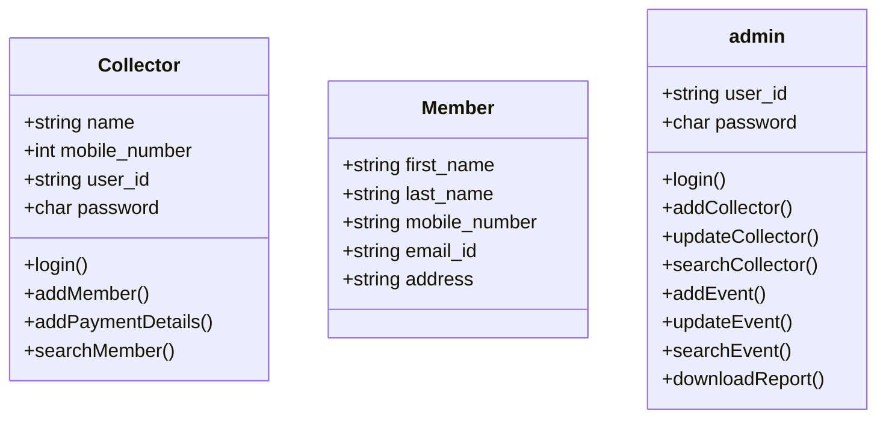

As a Collector	
1. As a collector, I should be able to login to app
2. As a collector, I should be able to add a member (*first name, last name, *mobile number, email id, address)
3. As a collector, I should be able to add the payment received details (select the event, type mobile number, payment mode (cash/online), amount recieved,If UPI selected enter transaction number) and generate a pdf receipt for same
4. As a collector, I should be able to search member with his/her mobile number and see all payment receipts, option so share it with whatsapp Or to email
	
As an Admin	
1.	As an admin, I should be able to login to web portal
2.	As an admin, I should be able to add collectors
3.	As an admin, I should be able to update, disable collectors
4.	As an admin, I should be able to search member with his/her mobile number and see all payment receipts, option so share it with whatsapp Or to email
5.	As an admin, I should be able to search member with his/her mobile number and update/edit details (no change in mobile number)
6.	As an admin, I should be able to search member with his/her first, last name, email id and update/edit details (no change in mobile number)
7.	As an admin, I should be able to create an event (event name, logo, duration, description)
8.	As an admin, I should be able to search the event through name, duration 
9.	As an admin, I should be able to search the event through name, duratio and update the details, disable
10.	As an admin, I should be able to download report of
  - Event details 
  - Collectors details
  - Members
  - Payment details Member wise
------------

